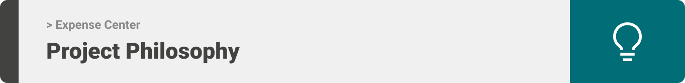
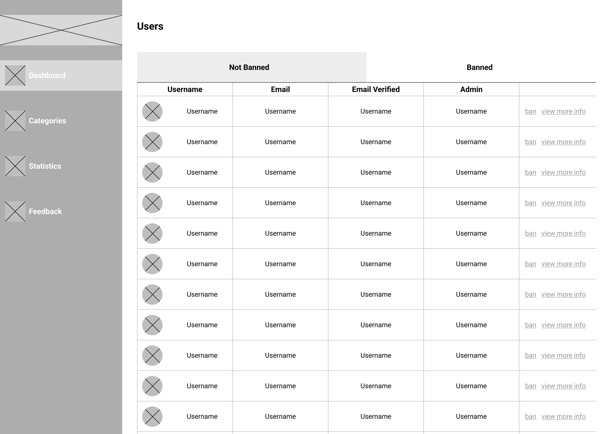
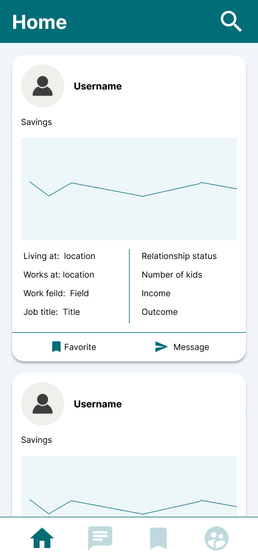
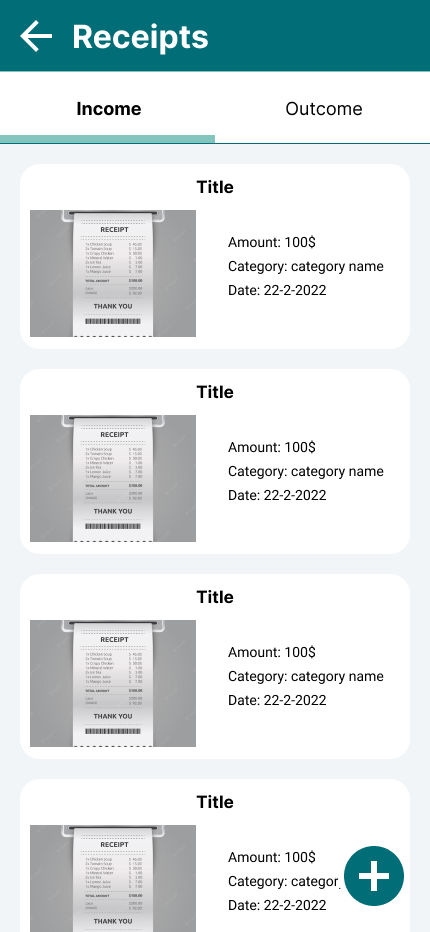
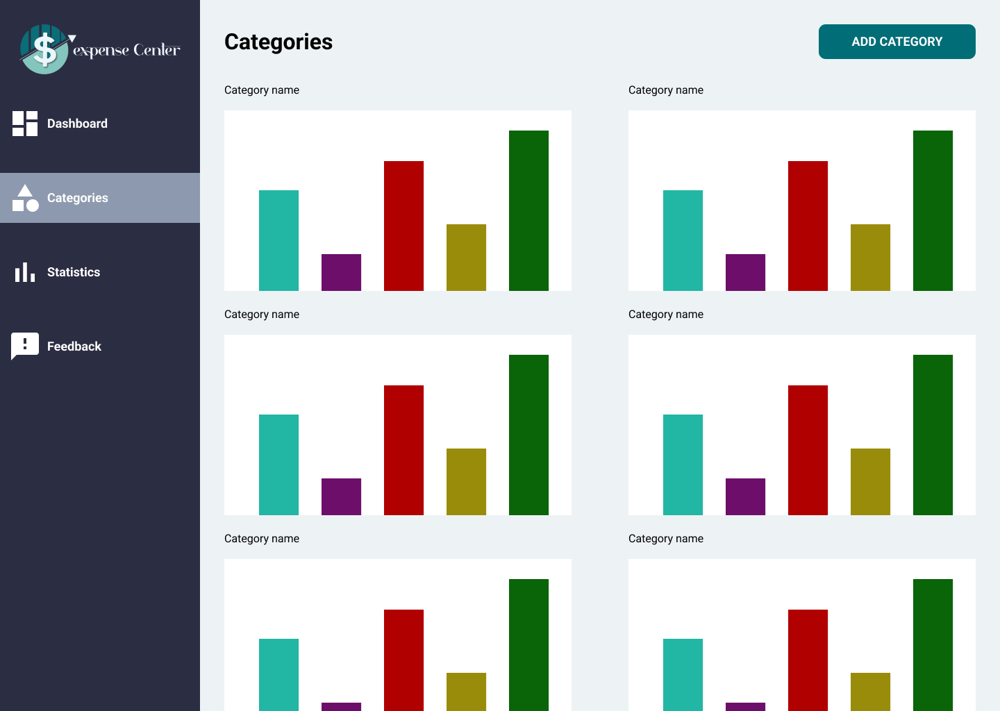
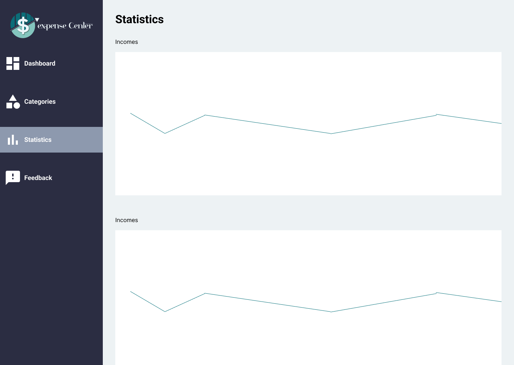
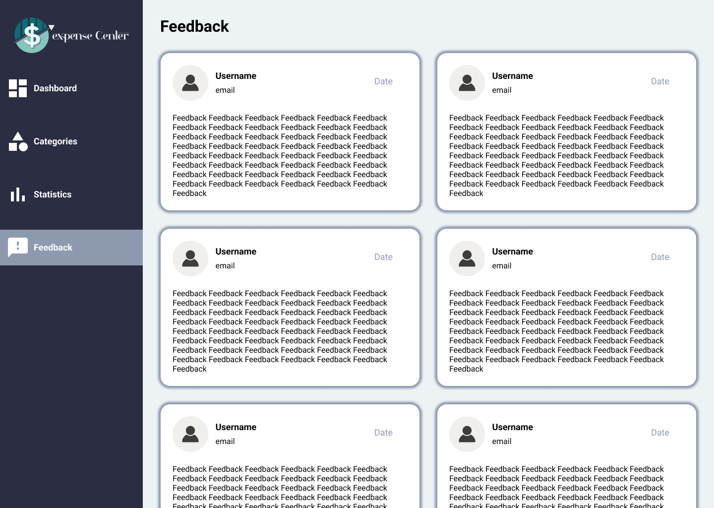
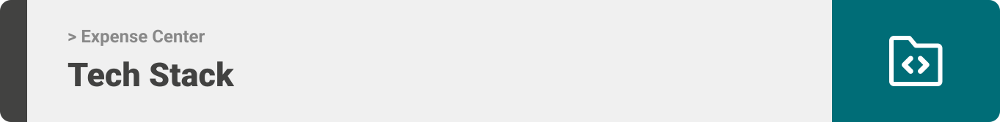

<div align="center">

> Expense Center is an intelligent expenses tracker for people that want to manage their financial lives and see others how they are managing theirs too.

**[PROJECT PHILOSOPHY](https://github.com/MoustafaIsm/expense-center#user-stories) • [WIREFRAMES](https://github.com/MoustafaIsm/expense-center#wireframes) • [TECH STACK](https://github.com/MoustafaIsm/expense-center#heres-a-brief-high-level-overview-of-the-tech-stack-the-well-app-uses) • [IMPLEMENTATION](https://github.com/MoustafaIsm/expense-center#user-mobile-application-2) • [HOW TO RUN?](https://github.com/MoustafaIsm/expense-center#prerequisites)**

</div>

<br><br>



> Ecpense Center is an app built to help you manage your financial life, It provides a way to store your receipts, and show them to you in a clear way. Expense Center is made for people to share their financial life with others, so if someone wants to get inspired by someone of their financial status they can.
>
> Expense Center provides a clear visualization of someone's financial life with graphs and lists. It provides a fast way for one to chat with another users that may help them manage their own life.

### User Stories

- As a user, I want to be able to see all my receipts that I receive in one place, so its easier for me to manage.
- As a user, I want to browse other people's financial life, so I can get inspired to change mine.
- As a user, I want to be able to chat with people with similar financial status, so that I know what things I'm doing wrong.

<br><br>


> This design was planned before on paper, then moved to Figma app for the fine details.
> Note that i didn't use any styling library or theme, all from scratch and using pure css modules

# Wireframes

### User mobile application

| Login                                    | Home                                         | Messages                                         | Profile                                         | Receipts                                         |
| ---------------------------------------- | -------------------------------------------- | ------------------------------------------------ | ----------------------------------------------- | ------------------------------------------------ |
|  |  |  |  |  |

### Admin desktop application

| Login                                          | Dashboard                                          |
| ---------------------------------------------- | -------------------------------------------------- |
|  |  |

| Categories                                          | Statistics                                          | Feedback                                          |
| --------------------------------------------------- | --------------------------------------------------- | ------------------------------------------------- |
|  |  |  |

# Mockups

### User mobile application

| Login                                 | Home                                      | Messages                                      |
| ------------------------------------- | ----------------------------------------- | --------------------------------------------- |
|  |  |  |

| Profile                                      | Receipts                                      | Prototype                     |
| -------------------------------------------- | --------------------------------------------- | ----------------------------- |
|  |  |  |

### Admin desktop application

| Login                                       | Dashboard                                       |
| ------------------------------------------- | ----------------------------------------------- |
|  |  |

| Categories                                       | Statistics                                       |
| ------------------------------------------------ | ------------------------------------------------ |
|  |  |

| Feedback                                       | Prototype                      |
| ---------------------------------------------- | ------------------------------ |
|  |  |

<br><br>



#### Here's a brief high-level overview of the tech stack the Well app uses:

- This project uses the [Ionic Framework](https://ionicframework.com/) with [Angular](https://angular.io/) to build the user frontend mobile application. Angular is a framework user to build cross-platform applications with the same code base, paired with Ionic that provides mobile UI toolkit for building modern, high quality cross-platform mobile apps.
- To build the admin panel for the website I have used [ElectronJS](https://www.electronjs.org/) to have a desktop application. It uses [ReactJS](https://reactjs.org/) library to build a component based elegant user interface. For a CSS Framework i have used [TailwindCSS](https://tailwindcss.com/) to help with styling of the interface.
- To display graphs I have used [ChatJs](https://www.chartjs.org/) for an easy way to deal with data visualization.
- For persistent storage (database), the app uses the [MySQL](https://www.mysql.com/) which is a relational database management system (RDBMS), that is based on structured query language (SQL).
- To access my database I used [Laravel Framework](https://laravel.com/) which is a web application framework with expressive, elegant syntax.
- The chatting part of the application was done using [Firebase](https://firebase.google.com/). The chat data were saved in the [Realtime database](https://firebase.google.com/docs/database?hl=en&authuser=0) in a NoSQL fashion.
- The notification system was done using [Cloud messaging](https://firebase.google.com/docs/cloud-messaging/?hl=en&authuser=0) with the help of [Cloud Functions](https://firebase.google.com/docs/functions?hl=en&authuser=0) to automate the sending notification part of the application.

<br><br>


> Uing the above mentioned tecch stacks and the wireframes build with figma from the user sotries we have, the implementation of the app is shown as below, these are screenshots from the real app

### User mobile application

| Login                                              | Home                                              | Messages                                              | Profile                                              | Receipts                                              |
| -------------------------------------------------- | ------------------------------------------------- | ----------------------------------------------------- | ---------------------------------------------------- | ----------------------------------------------------- |
|  |  |  |  |  |

### Admin desktop application

| Login                                               | Dashboard                                               |
| --------------------------------------------------- | ------------------------------------------------------- |
|  |  |

| Categories                                               | Statistics                                               | Feedback                                                |
| -------------------------------------------------------- | -------------------------------------------------------- | ------------------------------------------------------- |
|  |  |  |

<br><br>


> To get a local copy up and running follow these simple steps.

### Prerequisites

- Install NPM from:

  https://nodejs.org/en/download

- Install composer from:

  https://getcomposer.org/download

- Database server:

  You need to download an Apache HTTP Server, MariaDB database server, recomended XAMPP :

  https://www.apachefriends.org

- Angular CLI :
  ```
  npm install -g @angular/cli
  ```
- ionic
  ```
  npm install -g @ionic/cli
  ```
- Firebase tools:
  ```
  npm install -g firebase-tools
  ```
- If you want to run the ionic application on an android emulator, follow this link:

  https://ionicframework.com/docs/developing/android

### Installation

_Below are the steps you need to follow after you have the prerequistes done._

1. Clone the repo
   ```
   git clone https://github.com/MoustafaIsm/expense-center.git
   ```
1. Install NPM packages for the admin frontend by going to `expense-center-admin-frontend` and running the following command
   ```
   npm install
   ```
1. Install NPM packages for the user frontend by going to `expense-center-user-frontend` and running the following command

   ```
   npm install
   ```

1. Install Composer packages for the backend server by going to `expense-center-server` and running the following command
   ```
   composer install
   ```

### Start the laravel server

Go to `expense-center-server` and :

1. Change the `.env.example` file to `.env`

1. Configure your `.env` file to have the right database name `expensecenterdb` and credentials.

1. Run
   ```
   php artisan key:generate
   ```
1. To add the database to your server, run
   ```
   php artisan migrate
   ```
1. To fill the database to temporary data, run
   ```
   php artisan db:seed
   ```
1. Run the server using, (make sure you have your XAMPP server running)
   ```
   php artisan server
   ```

### Start Firebase server (for cloud functions)

Go to `expense-center-firebase-server` and :

1. Go to [Firebase](https://firebase.google.com/) and create an account and a project.

1. Go to your project settings, then service accounts, press on Firebase Admin SDK. Generate new private key (It will download a JSON file).

1. Rename that file to `account-credentials.json`, and move it to `expense-center-firebase-server/functions/config`.

1. Now you can either deploy the function on your firebase project (require a credit card linked to your account)
   ```
   firebase deploy
   ```

or run the cloud functions on an emulator

1. Go to this [Link](https://firebase.google.com/docs/web/learn-more?authuser=0&hl=en#config-object) to help you get your firebase configuration for the application.

1. In the user frontend, have a copy of the file `src/environments/environment.prod.ts` as `environtment.ts` and add your firebase configuration in it.

1. Run for the backend server
   ```
   php artisan serve
   ```
1. Run for the admin frontend
   ```
   npm run both
   ```
1. Run for the user frontend
   ```
   ionic serve
   ```
